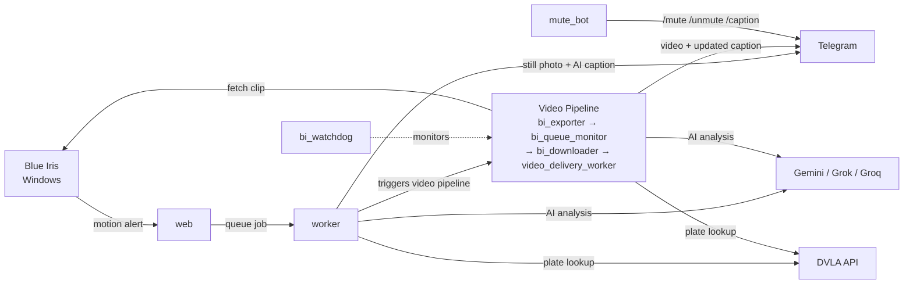

# Blue Iris AI Hub

AI-powered motion alert processor for [Blue Iris](https://blueirissoftware.com/). When a camera triggers, it analyses the image with Gemini AI, sends a Telegram notification with a caption, and optionally fetches and sends the full video clip.

## Features

- **AI vision analysis** — Gemini 2.5 Flash with automatic API key rotation and fallback to Grok / Groq
- **Video clips** — exports the alert clip from Blue Iris, analyses it with Gemini, and replaces the still photo in Telegram with the video
- **Telegram notifications** — AI-generated captions sent with each alert; captions are updated in-place when video analysis completes
- **Instant notify** — optional per-camera mode that sends the photo immediately with a fallback caption, then updates it once AI analysis completes (guarantees delivery even when Gemini is slow)
- **Auto-mute** — silences a camera automatically after 5 triggers in 10 minutes (prevents spam)
- **Caption modes** — switch to `hilarious`, `witty`, or `rude` captions via Telegram bot commands
- **Known plates** — teach the AI to recognise and label your vehicles by number plate
- **DVLA enrichment** — any UK number plate detected in a caption is automatically looked up against the DVLA API and annotated with make, colour, year, and tax/MOT status
- **Plate audit log** — every plate lookup is recorded with full DVLA details and a thumbnail of the alert image, viewable in the web UI
- **Web UI** — configure cameras, view logs, manage mutes and plates at `http://your-host:5000`
- **Update notifications** — the UI checks GitHub for new releases and shows a banner when one is available

## Quick Start

### Requirements

- Docker and Docker Compose
- A [Gemini API key](https://aistudio.google.com/) (free tier works)
- A Telegram bot token and chat ID
- Blue Iris running on Windows with `curl.exe` available

### 1. Download and start

```bash
mkdir blueiris-ai-hub && cd blueiris-ai-hub
curl -O https://raw.githubusercontent.com/slflowfoon/blueiris-ai-hub/main/docker-compose.yml
docker compose up -d
```

The web UI will be available at `http://your-host:5000`.

### 2. Add a camera configuration

Open the web UI and click **+ New Configuration**. Fill in:

| Field | Description |
|-------|-------------|
| Name | Camera name (e.g. `Driveway`) |
| Gemini API Key(s) | One or more keys, comma-separated for rotation |
| Telegram Bot Token | From [@BotFather](https://t.me/BotFather) |
| Telegram Chat ID | The chat or group to send alerts to |
| Message Thread ID | Optional — for Telegram topic groups |
| AI Prompt | What to ask the AI about each alert image |
| Blue Iris URL | e.g. `http://192.168.1.100:81` (required for video) |
| BI Username / Password | Blue Iris credentials (required for video) |
| Instant notify | Send photo immediately with "Motion detected.", update caption when AI responds (optional) |
| DVLA API Key | Optional — enables automatic number plate enrichment for UK plates |
| Recovery URL | URL of the `bi_recovery.py` endpoint on your Windows host (optional — enables automated encoder restart) |
| Recovery Token | Secret token matching `BI_RECOVERY_SECRET` on the Windows host |

### 3. Configure Blue Iris

The web UI shows the exact **curl parameters** to paste into Blue Iris for each configuration.

1. Open Blue Iris → Camera Settings → **Alerts** tab
2. Under **On alert**, add a **Run a program or write to a file** action
3. Set **File** to `curl.exe`
4. Set **Parameters** to the value shown in the web UI (copy button provided)
5. Set **Window** to `Hide`
6. Uncheck **Wait for process to complete**

Replace `<AlertsFolder>` in the parameters with your Blue Iris alerts path (found in **Global Settings → Storage**).

## Telegram Bot Commands

Once running, send these commands in your alert chat:

| Command | Description |
|---------|-------------|
| `/mute <minutes>` | Mute all cameras |
| `/mute <camera> <minutes>` | Mute one camera |
| `/unmute` | Unmute all |
| `/unmute <camera>` | Unmute one camera |
| `/status` | Show active mutes and caption mode |
| `/caption hilarious\|witty\|rude [minutes]` | Set caption style |
| `/caption off` | Reset to normal captions |
| `/help` | Show command list |

## AI Fallback Chain

Each alert tries AI providers in order until one succeeds:

1. **Gemini** (rotates across keys and models: `gemini-2.5-flash` → `gemini-2.5-flash-lite`)
2. **Grok** (`grok-4-0709`) — optional, add key in configuration
3. **Groq** (`meta-llama/llama-4-scout-17b-16e-instruct`) — optional, add key in configuration

## BI Encoder Recovery

Blue Iris's video export encoder can deadlock after extended uptime (typically 3+ weeks), causing clip exports to stall indefinitely. The hub detects this automatically and can trigger a remote restart of the Blue Iris Windows service.

### Setup

**On your Windows machine**, run `bi_recovery.py` as a startup task:

1. Copy `bi_recovery.py` to your Blue Iris machine
2. Set a strong secret token:
   ```powershell
   $env:BI_RECOVERY_SECRET = "your-secret-here"
   ```
3. Register it as a Task Scheduler startup task (run as Administrator):
   ```powershell
   powershell -NoProfile -ExecutionPolicy Bypass -File register_bi_recovery.ps1
   ```
   Or start it manually:
   ```powershell
   $env:BI_RECOVERY_SECRET = "your-secret-here"
   python bi_recovery.py
   ```
   The endpoint listens on port `9090` by default (override with `BI_RECOVERY_PORT`).

**In the hub UI**, edit each camera configuration and set:
- **Recovery URL** — `http://<windows-ip>:9090/restart-bi`
- **Recovery Token** — the same secret you set in `BI_RECOVERY_SECRET`

### How it works

If a clip export has not progressed through the BI export queue within 180 seconds, the hub concludes the encoder is stuck and:

1. POSTs to the recovery endpoint on your Windows machine
2. The Windows service is force-stopped and restarted (~13 seconds)
3. The hub re-submits the export and retries the download

Configs without a Recovery URL set skip this step and the export fails gracefully.

> **Tip:** Also set up a weekly scheduled restart as a preventive measure — this stops the encoder reaching the deadlock state in the first place.

## Updating

When a new version is released, the web UI shows an update banner. Run:

```bash
docker compose pull
docker compose up -d
```

## Architecture

| Service | Description |
|---------|-------------|
| `web` | Flask app — webhook receiver and configuration UI (gunicorn) |
| `worker` | Background task processor (Redis Queue) — handles AI analysis and Telegram sends |
| `bi_exporter` | Blue Iris export submitter — starts BI exports and records staged export jobs |
| `bi_queue_monitor` | Shared BI queue poller — watches `_export` and promotes finished jobs to download |
| `bi_downloader` | Blue Iris downloader — validates and downloads completed exports |
| `bi_watchdog` | Stranded-job watchdog — repairs stale export, download, and delivery states |
| `video_delivery_worker` | Telegram delivery worker — replaces the still image with video and updates the caption after BI download completes |
| `mute_bot` | Telegram bot polling loop — handles `/mute`, `/unmute`, `/caption` commands |
| `redis` | Job queue and state store (mutes, caption modes, API key rotation, export jobs) |


